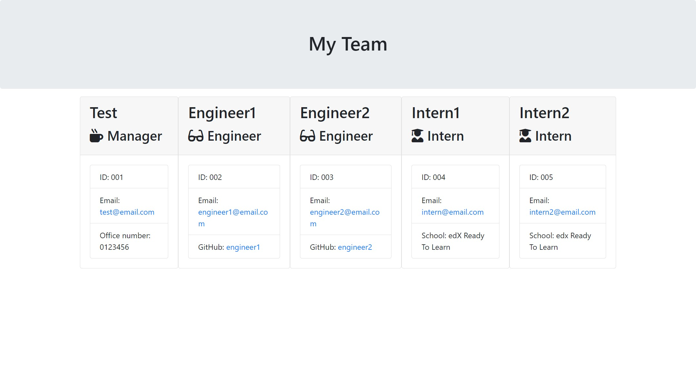

# Team-Profile-Generator

## Overview

This application allows the manager of an engineering team to generate a HTML web page for quick access of the teams information such as their emails and Github profiles, using Node.js command-line application.

## Installation

Before you start, make sure Node.js is installed and ready to run. The generator also requires [Jest](https://www.npmjs.com/package/jest) for running the unit tests and [Inquirer](https://www.npmjs.com/package/inquirer) for collecting the inputs from the user. These packages can be installed via `npm install`.

## Usage

In the command-line, the user will be prompted to enter information about the team members; manager, engnieer and/or intern; with their names, employee ID, email addresses and Github/Office number/School. Once the team information has been collected and the user has confirmed "I do not want to add any team members". The application will render the information and generating a a card-like formatted bootstrap HTML web page.

## Screenshot

The following image shows a mock-up of the generated HTML’s appearance and functionality:

## Credits & Resources

The following tutorials and/or references used in the project:

- README.md files provided by edX Bootcamp were used and can be found in the assets folder.
- Class Activities and the help of tutor assistant

## License

MIT License; Copyright (c) 2022 Mehr-Un-Nasa Hejazi Please refer to the LICENSE in the repository for further information.
